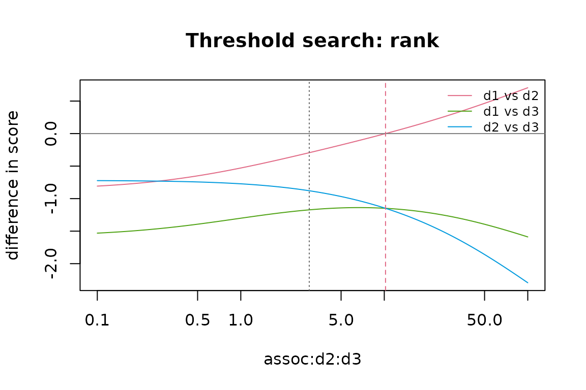

# Threshold searches and many diseases

``` r

library(deconflate)
```

This vignette covers two extensions: threshold searches and screens,
which show how much the conclusions depend on single inputs (including
inputs that have not been estimated), and the sampled backend of the
global model, for more diseases than can be enumerated.

## Threshold searches

[`cm_threshold()`](https://rasmussenphilip.github.io/deconflate/reference/cm_threshold.md)
varies one input over a range, with every other input fixed at the
model’s values, and finds the values at which a conclusion changes.
There are four kinds of conclusion:

- `"rank"`: two diseases swap places, ranked by their contribution to
  the aggregate (`by = "adjusted"` ranks by adjusted impact instead);
- `"sign"`: a disease’s adjusted impact crosses zero (for event impacts,
  its adjusted hazard ratio crosses 1). This is a sign change implied by
  the model and its inputs; it is not by itself evidence of a protective
  effect;
- `"total"`: the aggregate crosses `target`, in the units of the
  impacts;
- `"change"`: the aggregate departs from its value at the model’s own
  input by the relative amount `target` (e.g. `-0.1` for a 10%
  reduction). This answers questions such as “what association strength
  would reduce the total by 10%?”, which is useful for pairs without an
  association.

For event impacts (`event_model = TRUE`), the aggregate is the risk
attributable to disease and the contributions are its Shapley allocation
([`vignette("event-impacts")`](https://rasmussenphilip.github.io/deconflate/articles/event-impacts.md)).

The input is keyed as in the `distributions` of
[`cm_model()`](https://rasmussenphilip.github.io/deconflate/reference/cm_model.md):
`"assoc:<d1>:<d2>"`, `"inter:<d1>:<d2>"`, `"prob:<disease>"`,
`"impact:<disease>"`, `"three:<d1>:<d2>:<d3>"` for a three-way ratio, or
`"risk"` for the overall risk of event impacts. A pair without an
association (unknown) is varied as an odds ratio.

Each point is adjusted as
[`deconflate()`](https://rasmussenphilip.github.io/deconflate/reference/deconflate.md)
would adjust it, with point estimates. With `method = "auto"` (the
default), the method is chosen for the point’s own inputs: the
simultaneous method when every pair has an association and there are no
interactions or three-way terms, the global method otherwise. When the
input is an impact, an interaction or the overall risk (which do not
change the joint distribution) and the adjustment uses the joint
distribution, it is fitted once and reused, or a `joint` from
[`fit_joint()`](https://rasmussenphilip.github.io/deconflate/reference/fit_joint.md)
can be passed; other inputs change the joint distribution, so it is
refitted at every point.

### How the search works

The response need not be monotonic, so the range is first scanned on a
grid of `n_grid` points (log-spaced for odds ratios, risk ratios and
three-way ratios). Each grid point is adjusted and classified as usable,
or by the reason it is not (`"infeasible"`, `"singular"`, `"undefined"`
for non-finite results, `"unresolved"`, `"unsupported"` or `"error"`).
Each pair of neighbouring usable points on which the conclusion differs
brackets a crossing, which is refined by bisection. As a result:

- every crossing in the range is reported, not only the first;
- stretches of unusable grid points are listed in `regions`, so that “no
  crossing found” can be told apart from “part of the range could not be
  evaluated”;
- a refined crossing counts as a threshold only if the compared quantity
  is close to zero on both sides of the final bracket. A jump across a
  pole, such as a nearly singular system, is reported as a
  `"discontinuity"`, never as a threshold;
- a crossing whose bisection lands on an unusable point is
  `"unresolved"`.

Thresholds are deterministic: they refer to the model’s input values,
one input at a time. Statements such as “the probability that d1 ranks
first” need the draws of
[`deconflate()`](https://rasmussenphilip.github.io/deconflate/reference/deconflate.md)
(`n_draws`;
[`vignette("uncertainty")`](https://rasmussenphilip.github.io/deconflate/articles/uncertainty.md));
probabilistic thresholds are not implemented.

### A relative change in the aggregate

In the Supplementary File example, d1 and d3 are independent (odds ratio
1), and the adjusted aggregate is about 2.109 percent:

``` r

m <- example_supplement()
deconflate(m, n_draws = 0)$totals
#>   raw_sum adjusted_total interaction_total
#> 1     2.5       2.109229                 0
th <- cm_threshold(m, "assoc:d1:d3", c(1, 50), conclusion = "change", target = -0.1)
th
#> <cm_threshold> change over assoc:d1:d3 in [1, 50] (baseline 1; method simultaneous)
#> Fixed: all inputs other than assoc:d1:d3 at the model's values.
#> 
#> Crossings:
#>   item    status threshold lower upper
#>  total threshold     5.264 5.264 5.264
#>                                   description
#>  the aggregate falls below the baseline - 10%
```

An odds ratio of about 5.26 between d1 and d3 would reduce the aggregate
by 10%, to about 1.898. The adjusted results at the two ends of the
final bracket are returned:

``` r

th$details[[1]]$below
#>   disease raw   adjusted      change estimand adjusted_for
#> 1      d1 2.5 -0.2776063 -1.11104251    crude         <NA>
#> 2      d2 5.0  3.5618863 -0.28762274    crude         <NA>
#> 3      d3 7.5  6.9589184 -0.07214422    crude         <NA>
th$details[[1]]$above
#>   disease raw   adjusted      change estimand adjusted_for
#> 1      d1 2.5 -0.2776063 -1.11104252    crude         <NA>
#> 2      d2 5.0  3.5618863 -0.28762274    crude         <NA>
#> 3      d3 7.5  6.9589184 -0.07214422    crude         <NA>
```

The search works in either direction. The odds ratio of d2 and d3 is 3
in the example; a weaker association, about 1.43, would increase the
aggregate by 10%, because less of the raw impacts is then attributed to
the associated disease:

``` r

cm_threshold(m, "assoc:d2:d3", c(0.2, 20), conclusion = "change", target = 0.1)$thresholds
#>   conclusion  item    status threshold    lower    upper        below
#> 1     change total threshold  1.433331 1.433331 1.433331 1.134299e-09
#>           above                                  description
#> 1 -4.971832e-10 the aggregate falls below the baseline + 10%
```

For a pair without an association, the baseline is the global method,
which fills the pair in from the maximum-entropy fit; the change is
relative to that fit. Here the pair d1:d3 is left out. The fitted
distribution gives it an odds ratio of about 1.14, and an odds ratio of
about 6.4 would reduce the aggregate by 10%:

``` r

m_unk <- cm_model(
  cm_diseases(c("d1", "d2", "d3"), c(0.10, 0.15, 0.20)),
  cm_impacts(c("d1", "d2", "d3"), c(2.5, 5, 7.5), units = "%"),
  associations = cm_associations(c("d1", "d2"), c("d2", "d3"), c(2, 3))
)
deconflate(m_unk, n_draws = 0)$unknown_pairs
#>   disease1 disease2 fitted_or
#> 1       d1       d3  1.143088
th_unk <- cm_threshold(m_unk, "assoc:d1:d3", c(1, 50), conclusion = "change", target = -0.1)
th_unk$thresholds[, c("item", "status", "threshold", "description")]
#>    item    status threshold                                  description
#> 1 total threshold  6.364532 the aggregate falls below the baseline - 10%
```

The baseline value of an unknown input is `NA` (`th_unk$baseline`). At
the grid points the pair has a value, so every pair has an association
and the simultaneous method is used there; it gives the same answer as
the global method would.

### Rankings

As the association of d2 and d3 strengthens, more of d2’s raw impact is
attributed to d3, and d2’s contribution falls. Above an odds ratio of
about 10.20, d1 contributes more than d2. Disease d3 contributes most
over the whole range:

``` r

th_rank <- cm_threshold(m, "assoc:d2:d3", c(0.1, 100), conclusion = "rank", n_grid = 201)
th_rank
#> <cm_threshold> rank over assoc:d2:d3 in [0.1, 100] (baseline 3; method simultaneous)
#> Fixed: all inputs other than assoc:d2:d3 at the model's values.
#> 
#> Crossings:
#>      item    status threshold lower upper                         description
#>  d1 vs d2 threshold      10.2  10.2  10.2 d1 moves above d2 (by contribution)
th_rank$summary
#>       item n_thresholds n_other                  result
#> 1 d1 vs d2            1       0      threshold(s) found
#> 2 d1 vs d3            0       0 none found in the range
#> 3 d2 vs d3            0       0 none found in the range
```

[`plot()`](https://rdrr.io/r/graphics/plot.default.html) shows the
compared quantities over the scan (here the differences in contribution
of each pair of diseases), the baseline value of the input (dotted) and
the thresholds (dashed):

``` r

plot(th_rank)
```



### Signs

The adjusted impact of d1 is negative when its raw impact is below about
0.374 percent:

``` r

th_sign <- cm_threshold(m, "impact:d1", c(-5, 5), conclusion = "sign", diseases = "d1")
th_sign$thresholds[, c("item", "status", "threshold", "description")]
#>   item    status threshold
#> 1   d1 threshold  0.374142
#>                                                                    description
#> 1 the adjusted value of d1 moves above no effect (a model-implied sign change)
```

Below that value, the raw impact of d1 is smaller than its associated
diseases alone would produce under the additive model. This says that
the inputs are inconsistent with the model there (or the estimands are
not what they were assumed to be), not that d1 is protective.

[`cm_threshold()`](https://rasmussenphilip.github.io/deconflate/reference/cm_threshold.md)
searches with the methods of
[`deconflate()`](https://rasmussenphilip.github.io/deconflate/reference/deconflate.md).
The published approximation, `m^2 / (m + c)`, kept for comparison only,
behaves differently: it has a pole where its denominator is zero, and
its adjusted impact changes sign there by jumping through infinity. For
d1, `c` is the part of the raw impact that the conflation matrix `A`
attributes to the other diseases, so the pole is at a raw impact of d1
of about -0.527:

``` r

A <- deconflate(m, n_draws = 0)$conflation$A
-sum(A["d1", c("d2", "d3")] * c(5, 7.5))
#> [1] -0.5266329
```

[`compare_methods()`](https://rasmussenphilip.github.io/deconflate/reference/compare_methods.md)
shows this on either side of the pole:

``` r

sapply(c(-0.60, -0.45), function(v) {
  mv <- cm_model(m, cm_impacts(c("d1", "d2", "d3"), c(v, 5, 7.5)))
  unlist(compare_methods(mv, methods = c("published", "simultaneous"))$impacts[1, -1])
})
#>                    [,1]       [,2]
#> raw          -0.6000000 -0.4500000
#> published    -4.9068328  2.6424676
#> simultaneous -0.9821118 -0.8308846
```

A search across such a pole reports a `"discontinuity"`, not a
threshold.

### A target in the units of the impacts

What raw impact of d2 would make the aggregate 3 percent (about 13.04)?

``` r

th_total <- cm_threshold(m, "impact:d2", c(0, 20), conclusion = "total", target = 3)
th_total$thresholds[, c("item", "status", "threshold", "description")]
#>    item    status threshold                          description
#> 1 total threshold  13.03899 the aggregate rises above the target
```

### Ranges that cannot be fully evaluated

A probability of 1 or more is impossible, so the grid points from just
above 1 are listed as an infeasible region. Below 1, d1 moves above d2
at a prevalence of about 0.224 and above d3 at about 0.622; d2 and d3 do
not swap where the range could be evaluated:

``` r

th_prob <- cm_threshold(m, "prob:d1", c(0.05, 1.5), conclusion = "rank")
th_prob
#> <cm_threshold> rank over prob:d1 in [0.05, 1.5] (baseline 0.1; method simultaneous)
#> Fixed: all inputs other than prob:d1 at the model's values.
#> 35 of 101 grid points could not be used:
#>   from  to     status n_points
#>  1.007 1.5 infeasible       35
#> 
#> Crossings:
#>      item    status threshold  lower  upper                         description
#>  d1 vs d2 threshold    0.2236 0.2236 0.2236 d1 moves above d2 (by contribution)
#>  d1 vs d3 threshold    0.6221 0.6221 0.6221 d1 moves above d3 (by contribution)
th_prob$summary
#>       item n_thresholds n_other                                        result
#> 1 d1 vs d2            1       0                            threshold(s) found
#> 2 d1 vs d3            1       0                            threshold(s) found
#> 3 d2 vs d3            0       0 none found where the range could be evaluated
```

### Event impacts

With `event_model = TRUE` and `overall_risk`, the search uses the
snapshot model of event impacts. The joint distribution is refitted at
every point when the input is an association, so these searches take
longer. With culling hazard ratios on the same population, the adjusted
hazard ratio of d3 falls below 1 when the odds ratio of d2 and d3
exceeds about 8.09:

``` r

cull <- cm_model(m, cm_impacts(c("d1", "d2", "d3"), c(1.5, 2.0, 1.3), measure = "HR",
                               estimand = "snapshot_crude", label = "culling"))
th_ev <- cm_threshold(cull, "assoc:d2:d3", c(1, 100), conclusion = "sign",
                      event_model = TRUE, overall_risk = 0.25)
th_ev$thresholds[, c("item", "status", "threshold", "description")]
#>   item    status threshold
#> 1   d3 threshold  8.089342
#>                                                                    description
#> 1 the adjusted value of d3 moves below no effect (a model-implied sign change)
```

The overall risk itself can be searched with the input `"risk"`.

## Screens

The screens re-run the adjustment over a set of scenarios, one input at
a time, and report how much the aggregate and the ranking of diseases
change. Like
[`cm_threshold()`](https://rasmussenphilip.github.io/deconflate/reference/cm_threshold.md),
they report point estimates, adjust each scenario as
[`deconflate()`](https://rasmussenphilip.github.io/deconflate/reference/deconflate.md)
would (`method = "auto"`), and take `event_model = TRUE` with
`overall_risk`:

- [`screen_associations()`](https://rasmussenphilip.github.io/deconflate/reference/screen_associations.md)
  multiplies each given association by each of `multipliers`, and sets
  each pair without an association to each of `or_values`;
- [`screen_interactions()`](https://rasmussenphilip.github.io/deconflate/reference/screen_interactions.md)
  adds an interaction of each size in `values` to each pair (additive
  impacts only; always the global method, with the joint distribution
  fitted once);
- [`screen_three_way()`](https://rasmussenphilip.github.io/deconflate/reference/screen_three_way.md)
  sets a three-way term for each triple (always the global method);
- [`sensitivity_oat()`](https://rasmussenphilip.github.io/deconflate/reference/sensitivity_oat.md)
  varies every input by `variation` (20% by default).

``` r

screen_associations(m, or_values = c(0.5, 3))
#> <cm_screen> 6 scenarios; baseline total 2.109
#>   pair    status scenario total  change rel_change max_rank_shift rank_corr
#>  d2:d3 specified OR x 0.5  2.31  0.1974     0.0936              0         1
#>  d2:d3 specified   OR x 2  1.94 -0.1643    -0.0779              0         1
#>  d1:d3 specified   OR x 2  2.01 -0.0963    -0.0457              0         1
#>  d1:d3 specified OR x 0.5  2.20  0.0859     0.0407              0         1
#>  d1:d2 specified   OR x 2  2.05 -0.0582    -0.0276              0         1
#>  d1:d2 specified OR x 0.5  2.16  0.0549     0.0260              0         1
#>  failed
#>    <NA>
#>    <NA>
#>    <NA>
#>    <NA>
#>    <NA>
#>    <NA>
sensitivity_oat(m)
#>         input value total_low total_high      swing  rel_swing
#> 1   impact:d3  7.50  1.844070   2.374387 0.53031715 0.25142703
#> 2     prob:d3  0.20  1.851628   2.374637 0.52300893 0.24796215
#> 3   impact:d2  5.00  1.998423   2.220035 0.22161264 0.10506809
#> 4     prob:d2  0.15  2.026335   2.197276 0.17094138 0.08104449
#> 5 assoc:d2:d3  3.00  2.170224   2.062015 0.10820854 0.05130242
#> 6   impact:d1  2.50  2.063348   2.155110 0.09176175 0.04350488
#> 7     prob:d1  0.10  2.069218   2.149697 0.08047878 0.03815555
#> 8 assoc:d1:d3  1.00  2.138876   2.084124 0.05475254 0.02595856
#> 9 assoc:d1:d2  2.00  2.127728   2.093846 0.03388228 0.01606382
```

A three-way term keeps the pairwise tables of its triple fixed, so for
additive impacts without interactions it changes nothing when every pair
of the triple has an association; with an unknown pair it can:

``` r

screen_three_way(m, ratios = c(0.5, 2))[, c("pair", "scenario", "total", "rel_change")]
#>      pair    scenario total rel_change
#>  d1:d2:d3 ratio = 0.5  2.11  -4.06e-11
#>  d1:d2:d3   ratio = 2  2.11   2.82e-11
screen_three_way(m_unk, ratios = c(0.5, 2))[, c("pair", "scenario", "total", "rel_change")]
#>      pair    scenario total rel_change
#>  d1:d2:d3   ratio = 2  2.06    -0.0144
#>  d1:d2:d3 ratio = 0.5  2.12     0.0138
```

### Without association estimates

[`deconflate()`](https://rasmussenphilip.github.io/deconflate/reference/deconflate.md)
needs at least one association; without any, there is nothing to
de-conflate:

``` r

m0 <- m
m0$associations <- NULL
tryCatch(deconflate(m0), deconflate_error = function(e) conditionMessage(e))
#> [1] "No association estimates were given, so there is nothing to de-conflate (the diseases would be treated as independent). To see how much associations could change the results, use screen_associations() or cm_threshold()."
```

The screens and
[`cm_threshold()`](https://rasmussenphilip.github.io/deconflate/reference/cm_threshold.md)
work without associations. The baseline then has every pair unknown, and
the maximum-entropy fit with no pairwise constraints makes the diseases
independent, so the baseline aggregate is the raw one.
[`screen_associations()`](https://rasmussenphilip.github.io/deconflate/reference/screen_associations.md)
shows which pairs would matter if they were associated, and
[`cm_threshold()`](https://rasmussenphilip.github.io/deconflate/reference/cm_threshold.md)
how strong an association would have to be to change the aggregate by a
given amount:

``` r

screen_associations(m0, or_values = c(0.5, 2, 4))
#> <cm_screen> 9 scenarios; baseline total 2.5
#>   pair  status scenario total  change rel_change max_rank_shift rank_corr
#>  d2:d3 unknown   OR = 4  2.09 -0.4143    -0.1657              0         1
#>  d1:d3 unknown   OR = 4  2.28 -0.2223    -0.0889              0         1
#>  d2:d3 unknown   OR = 2  2.28 -0.2158    -0.0863              0         1
#>  d2:d3 unknown OR = 0.5  2.70  0.1984     0.0794              0         1
#>  d1:d2 unknown   OR = 4  2.35 -0.1488    -0.0595              0         1
#>  d1:d3 unknown   OR = 2  2.38 -0.1171    -0.0468              0         1
#>  d1:d3 unknown OR = 0.5  2.60  0.1042     0.0417              0         1
#>  d1:d2 unknown   OR = 2  2.43 -0.0733    -0.0293              0         1
#>  d1:d2 unknown OR = 0.5  2.56  0.0588     0.0235              0         1
#>  failed
#>    <NA>
#>    <NA>
#>    <NA>
#>    <NA>
#>    <NA>
#>    <NA>
#>    <NA>
#>    <NA>
#>    <NA>
th0 <- cm_threshold(m0, "assoc:d2:d3", c(1, 50), conclusion = "change", target = -0.1)
th0$thresholds[, c("item", "status", "threshold", "description")]
#>    item    status threshold                                  description
#> 1 total threshold  2.238207 the aggregate falls below the baseline - 10%
```

An odds ratio of about 2.24 between d2 and d3 (with the other pairs
unknown) would reduce the aggregate by 10%. Such results show which
associations are worth estimating; they are not estimates themselves.
Tables read with
[`cm_read_inputs()`](https://rasmussenphilip.github.io/deconflate/reference/cm_read_inputs.md)
can leave out `associations` for this purpose.

## Many diseases

### What limits the number of diseases

The simultaneous method (and the published approximation in
[`compare_methods()`](https://rasmussenphilip.github.io/deconflate/reference/compare_methods.md))
uses the pairwise 2x2 tables only. It never enumerates combinations of
diseases, so it works for any number of diseases (the default triple
screen checks n(n-1)(n-2)/6 triples; the exact LP feasibility check is
limited to 14 diseases).

The global method needs the joint distribution of disease combinations,
for interactions, unknown pairs and three-way terms, and so does the
snapshot model of event impacts. The exact backend of
[`fit_joint()`](https://rasmussenphilip.github.io/deconflate/reference/fit_joint.md)
enumerates all 2^n combinations, which limits it to about 20 diseases
(`max_diseases`). For more, the sampled backend fits the same
maximum-entropy model without enumeration.
[`deconflate()`](https://rasmussenphilip.github.io/deconflate/reference/deconflate.md)
uses it automatically when a model with more than 20 diseases needs the
joint distribution, and says so in a note;
`fit_joint(backend = "sampled")` runs it directly.

### The sampled backend

The sampled backend works in three steps:

1.  **Calibration.** The model has a main effect for each disease and an
    interaction parameter for each constrained pair (three-way terms are
    fixed at the log of their ratios). Many parallel Gibbs chains
    (`n_chains`) estimate the disease probabilities and pairwise tables
    implied by the current parameters, and the parameters are updated by
    the differences between the target and estimated logits and log odds
    ratios, until the estimates match the targets within Monte Carlo
    error. The interaction parameters are conditional log odds ratios,
    given the other diseases. They are calibrated, not set to the
    marginal log odds ratios of the inputs, which are only their
    starting values: with several associated diseases, the two differ.
2.  **Sampling.** `n_samples` combinations are drawn from the calibrated
    model.
3.  **Raking** (`calibrate = TRUE`, the default). The weights of the
    sampled combinations are adjusted by iterative proportional fitting
    so that the disease probabilities and pairwise tables match the
    targets exactly on the sample. The remaining Monte Carlo error
    affects only the higher-order structure (triples and beyond), and
    the odds ratios of unknown pairs.

The result has the same form as an exact fit (the distinct sampled
combinations and their weights), so the global method, interaction
offsets, Shapley allocation and the snapshot model of event impacts use
it unchanged. Its `diagnostics` report:

- the constraint residual of the raw sample and after raking;
- R-hat and effective sample sizes of the fitted probabilities and
  pairwise tables, from the spread between chains;
- Monte Carlo standard errors of these moments.

A sampled fit is an approximation with Monte Carlo error. Check it
against the exact backend on smaller systems where that is possible, and
compare fits with different seeds.

### Three diseases: sampled and exact

``` r

je <- fit_joint(m)
js <- fit_joint(m, backend = "sampled", n_samples = 20000, n_chains = 500, seed = 11)
js
#> <cm_joint> 3 diseases, 8 combinations (sampled backend)
#>   Converged: TRUE after 17 calibration iterations (max residual 1.08e-11)
#>   Constrained pairs: 3
#>   Sample: 20000 draws from 500 chains, 8 distinct combinations
#>   Constraint residual: 9.55e-03 in the sample, 1.08e-11 after raking; max R-hat 1.002; min ESS 16763
js$diagnostics$summary
#>   n_samples n_chains n_unique fit_iterations fit_converged residual_sample
#> 1     20000      500        8             17          TRUE         0.00955
#>   residual_calibrated max_rhat  min_ess    max_mcse
#> 1        1.083127e-11 1.002484 16763.48 0.003019871
js$diagnostics$moments
#>       moment     target sampled      residual         mcse      rhat      ess
#> 1    prob:d1 0.10000000 0.10175  0.0017500000 0.0021830957 1.0005498 19177.24
#> 2    prob:d2 0.15000000 0.15955  0.0095500000 0.0028188627 1.0023811 16875.66
#> 3    prob:d3 0.20000000 0.20410  0.0041000000 0.0030198707 1.0015774 17812.50
#> 4 pair:d1:d2 0.02447939 0.02425 -0.0002293925 0.0011375249 1.0012028 18286.41
#> 5 pair:d1:d3 0.02000000 0.01955 -0.0004500000 0.0009591324 0.9994854 20836.04
#> 6 pair:d2:d3 0.05672700 0.05945  0.0027229966 0.0018263532 1.0024836 16763.48
```

The probabilities of the eight combinations, exact and sampled:

``` r

cmb <- merge(combination_probs(je), combination_probs(js),
             by = c("d1", "d2", "d3", "n_diseases"), suffixes = c("_exact", "_sampled"))
cmb[order(-cmb$prob_exact), ]
#>   d1 d2 d3 n_diseases  prob_exact prob_sampled
#> 1  0  0  0          0 0.642622560  0.642671624
#> 2  0  0  1          1 0.131856833  0.131807768
#> 3  0  1  0          1 0.077377440  0.077328376
#> 5  1  0  0          1 0.064104444  0.064055379
#> 4  0  1  1          2 0.048143167  0.048192232
#> 7  1  1  0          2 0.015895556  0.015944621
#> 6  1  0  1          2 0.011416164  0.011465228
#> 8  1  1  1          3 0.008583836  0.008534772
```

A second seed gives a different sample; the differences between seeds
show the size of the Monte Carlo error. The distribution of the number
of diseases per animal:

``` r

js2 <- fit_joint(m, backend = "sampled", n_samples = 20000, n_chains = 500, seed = 12)
by_n <- function(j) tapply(j$prob, rowSums(j$cells), sum)
rbind(exact = by_n(je), seed_11 = by_n(js), seed_12 = by_n(js2))
#>                 0         1          2           3
#> exact   0.6426226 0.2733387 0.07545489 0.008583836
#> seed_11 0.6426716 0.2731915 0.07560208 0.008534772
#> seed_12 0.6426916 0.2731317 0.07566194 0.008514817
```

With an interaction, the global method depends on probabilities of
disease triples, which the sampled fit approximates:

``` r

mi <- set_interaction(m, "d1", "d2", 1)
rbind(exact = deconflate(mi, n_draws = 0, joint = je)$adjusted$adjusted,
      sampled = deconflate(mi, n_draws = 0, joint = js)$adjusted$adjusted)
#>             [,1]     [,2]     [,3]
#> exact   1.913880 3.240641 6.935621
#> sampled 1.913888 3.240574 6.935939
```

A fitted joint can be passed to
[`deconflate()`](https://rasmussenphilip.github.io/deconflate/reference/deconflate.md),
[`compare_methods()`](https://rasmussenphilip.github.io/deconflate/reference/compare_methods.md)
and
[`cm_threshold()`](https://rasmussenphilip.github.io/deconflate/reference/cm_threshold.md)
with `joint`. Alternatively, the fitting arguments can be passed through
`...`,
e.g. `deconflate(m, method = "global", backend = "sampled", n_samples = 20000)`.

### Unresolved is not infeasible

If the calibration does not converge, or the raking does not match the
targets, the fit is reported as unresolved: `converged` is `FALSE`, a
warning of class `deconflate_nonconvergence` is given, and
[`deconflate()`](https://rasmussenphilip.github.io/deconflate/reference/deconflate.md)
refuses to use the fit. This does not show that the inputs are
infeasible: more samples, chains or iterations may resolve it.
[`check_feasibility()`](https://rasmussenphilip.github.io/deconflate/reference/check_feasibility.md)
tests feasibility directly. Here the inputs are infeasible, which the
triple screen shows:

``` r

bad <- cm_population(cm_diseases(c("a", "b", "c"), c(0.5, 0.5, 0.5)),
                     cm_associations(c("a", "a", "b"), c("b", "c", "c"), c(20, 20, 0.05)))
jb <- fit_joint(bad, backend = "sampled", n_samples = 2000, n_chains = 100,
                fit_iter = 20, seed = 1)
#> Warning: The sampled joint distribution is unresolved (calibration did not
#> converge; sample residual 2.67e-01; raking residual 1.64e-01). This does not
#> show that the inputs are infeasible; try more samples, chains or iterations, or
#> check_feasibility().
jb$converged
#> [1] FALSE
check_feasibility(bad, method = "triples")
#> <cm_feasibility> NOT jointly feasible [triples]
#> 
#> Conflicting triples:
#>  disease1 disease2 disease3   gap
#>         a        b        c 0.226
```

### Twenty-four diseases

A synthetic population of 24 diseases with prevalences from 0.05 to 0.3,
an odds ratio of 2 between consecutive diseases (x01 with x02, x02 with
x03, and so on; the other 253 pairs are unknown) and raw impacts from 1
to 5 percent:

``` r

ids <- sprintf("x%02d", 1:24)
pop24 <- cm_population(
  cm_diseases(ids, seq(0.05, 0.3, length.out = 24)),
  cm_associations(ids[-24], ids[-1], 2)
)
m24 <- cm_model(pop24, cm_impacts(ids, seq(1, 5, length.out = 24), units = "%"))
```

The exact backend would need 2^24 (about 16.8 million) combinations and
refuses:

``` r

tryCatch(fit_joint(pop24), deconflate_error = function(e) conditionMessage(e))
#> [1] "24 diseases give 2^24 cells; use backend = \"sampled\", or increase `max_diseases` if intended."
```

The unknown pairs need the global method, and with 24 diseases
[`deconflate()`](https://rasmussenphilip.github.io/deconflate/reference/deconflate.md)
fits the joint distribution with the sampled backend (with the default
`n_samples` and `n_chains` of
[`fit_joint()`](https://rasmussenphilip.github.io/deconflate/reference/fit_joint.md)).
The `seed` argument of
[`deconflate()`](https://rasmussenphilip.github.io/deconflate/reference/deconflate.md)
is for its draws; to make the sampled fit reproducible, set the random
seed before the call, or fit it with `fit_joint(..., seed = )` and pass
it with `joint`:

``` r

set.seed(3)
r24 <- deconflate(m24, n_draws = 0)
r24$notes
#> [1] "The global method was used because of 253 pairs without an association (unknown)."             
#> [2] "With 24 diseases, the joint distribution was fitted with the sampled backend (see ?fit_joint)."
r24$joint
#> <cm_joint> 24 diseases, 24537 combinations (sampled backend)
#>   Converged: TRUE after 17 calibration iterations (max residual 2.32e-12)
#>   Constrained pairs: 23
#>   Sample: 50000 draws from 1000 chains, 24537 distinct combinations
#>   Constraint residual: 4.70e-03 in the sample, 2.32e-12 after raking; max R-hat 1.002; min ESS 43146
r24$totals
#>    raw_sum adjusted_total interaction_total
#> 1 14.77391       11.57177                 0
```

The odds ratios the fit gives the unknown pairs come from the sample, so
they carry Monte Carlo error (see the raking step above), and so do the
adjusted impacts that depend on them:

``` r

summary(r24$unknown_pairs$fitted_or)
#>    Min. 1st Qu.  Median    Mean 3rd Qu.    Max. 
#>  0.8591  0.9807  1.0021  1.0073  1.0283  1.2301
```

An interaction (1 percentage point when x12 and x13 occur together) does
not change the joint distribution, so the fit is reused:

``` r

m24i <- set_interaction(m24, "x12", "x13", 1)
r_int <- deconflate(m24i, n_draws = 0, joint = r24$joint)
near <- ids[10:15]
data.frame(disease = near,
           raw = r24$adjusted$raw[match(near, ids)],
           no_interaction = r24$adjusted$adjusted[match(near, ids)],
           interaction = r_int$adjusted$adjusted[match(near, ids)])
#>   disease      raw no_interaction interaction
#> 1     x10 2.565217       2.154282    2.152973
#> 2     x11 2.739130       2.173030    2.170177
#> 3     x12 2.913043       2.313843    2.064371
#> 4     x13 3.086957       2.322939    2.089923
#> 5     x14 3.260870       2.643353    2.647016
#> 6     x15 3.434783       2.594803    2.595581
r_int$totals
#>    raw_sum adjusted_total interaction_total
#> 1 14.77391       11.53431        0.04696013
```

The adjusted impacts of x12 and x13 fall, because part of their raw
impacts is now attributed to the interaction; the other diseases change
little. These values carry Monte Carlo error from the sampled triples.
In an analysis, refit the joint distribution with another seed (or more
samples) and check that the conclusions do not change.

The run time of a sampled fit grows with `n_samples` and `n_chains`, and
that of the raking step with the number of constrained pairs (the pairs
with an association) times the number of distinct sampled combinations.
Draws (`n_draws`) refit the joint distribution for every draw, which is
slow with the sampled backend; check the run time on a few draws first.
